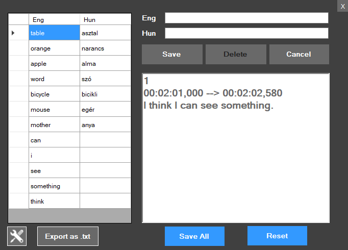
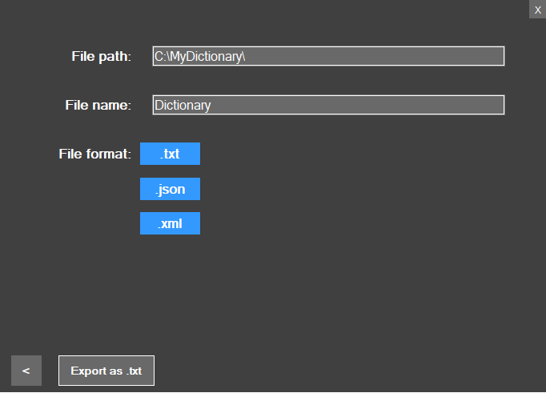

# DictionaryInWinform
#### Description:   
This is my hobby project - an Eng-Hun dictionary WinForms application.
In this application, you can add English and Hungarian word pairs, sentences, or .srt/.txt files to the database easily. In this project I practiced:
- serialization,
- add data to the database,
- work with WinForms 

  
#### Usage:  
There are two ways to add words to the database:  
-You can add word pairs manually,  
-You can add/paste words, sentences, or drag and drop txt. or srt. files in the richTextBox.  
If you click on the save button the program will check if the database contains these English words before adding, so every English word will be unique. There is a settings button below, click on it you can serialize and import your words of the database to .txt, .xml, .json.
Feel free to use it.
#### Installation:  
The code is open source, you can clone the repository and use it.
